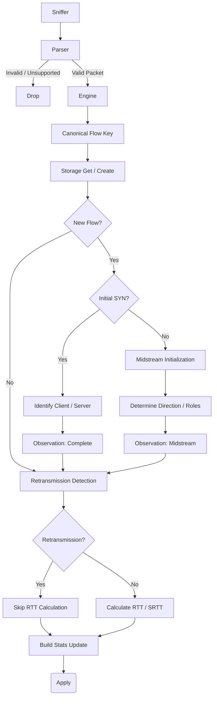

# Zero-Allocation TCP Analyzer

## Flow обработки пакетов

```mermaid
flowchart TD
    A[Sniffer] --> B[Parser]
    B -->|Invalid / Unsupported| X[Drop]
    B -->|Valid Packet| C[Engine]
    C --> D[Canonical Flow Key]
    D --> E[Storage Get / Create]
    E --> F{New Flow?}

    F -->|No| K[Retransmission Detection]
    F -->|Yes| G{Initial SYN?}

    G -->|Yes| H[Identify Client / Server]
    H --> I[Observation: Complete]

    G -->|No| J[Midstream Initialization]
    J --> L[Determine Direction / Roles]
    L --> M[Observation: Midstream]

    I --> K
    M --> K

    K --> N{Retransmission?}
    N -->|Yes| O[Skip RTT Calculation]
    N -->|No| P[Calculate RTT / SRTT]

    O --> Q[Build Stats Update]
    P --> Q

    Q --> R(Apply)
```
